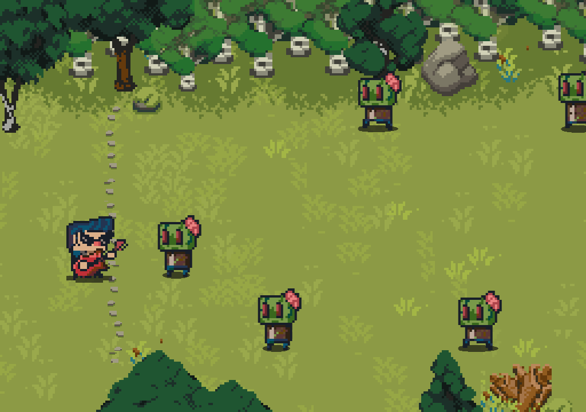

# Guitarist V Zombies

This repository contains the code for the game "Guitarist V Zombies". It is a fun and exciting game where you play as a guitarist defending yourself against hordes of zombies using the power of music.

## Installation

To install and run the game, follow these steps:

1. Clone the repository: `git clone https://github.com/suramyadas01/Guitarist-V-Zombies.git`
2. Navigate to the project directory: `cd Guitarist-V-Zombies`
3. Install the dependencies: `npm install`
4. Start the game: `npm start`

## Gameplay

In this game, you control the guitarist character using your real guitar. Additionally support has been added for being able to play the game using WASD keys. Your goal is to defeat as many zombies as possible by playing the correct notes on your guitar. Be careful not to miss any notes, as the zombies will get closer to you!

The notes as of now are linked to certain scales so yo can enjoy a bit of freestyling while defeating the zombies. The goal is to have fun.

## Challenges and Bugs?
The code does have an issue at the moment. When the guitar is played through an audio interface, the output is clean and accurate. However, when the microphone is used, due to interference, there is some noise which kind of makes the experience bad. 

## Contributing

Contributions are welcome! If you have any ideas, bug reports, or feature requests, please open an issue or submit a pull request.

## License

This project is licensed under the [MIT License](LICENSE).
